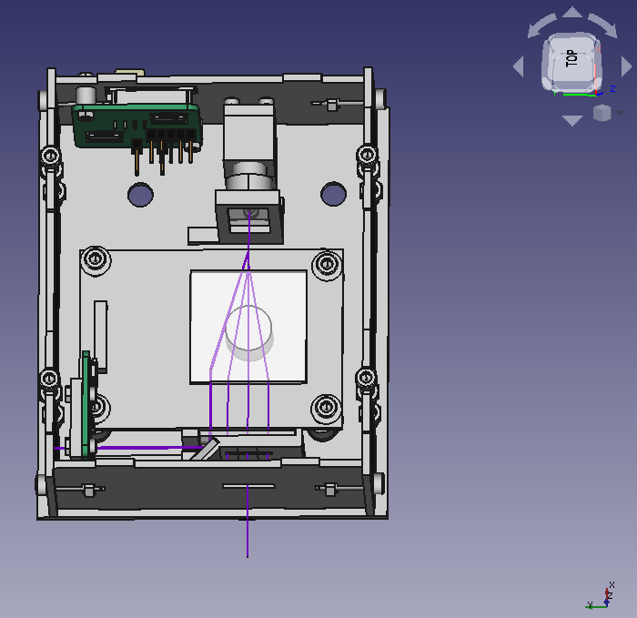

# Design 

This folder contains the Computer Animated Design (CAD) files to build an [open hardware fast high resolution laser.](https://reprap.org/wiki/Open_hardware_fast_high_resolution_LASER)
The laser module is designed in FreeCAD so it can be edited by anyone.
Most of the components can be laser cut to facilitate mass production.
Non-flat components are intended be printed on a fused filament fabrication printer.

The main file of interest is fullassembly.FCStd.  

# Notes

## Instruction Videos
Assembly 4 Design, without optical simulation  
https://youtu.be/jhr6iEazbQk  
Assembly 4 design, with optical simulation  
https://youtu.be/kekMkjqzRjE  

## Render 
To create a render of the laser rays, additional code is needed.

Freecad workbench  
https://github.com/hstarmans/freecad_hexastorm  
Python library with prism simulation  
https://github.com/hstarmans/opticaldesign  

## File structure

FreeCAD files folder contains the designs. Freecad 0.19 with assembly 4 and Kicad Stepup is used.
Deprecated folder contains the old design files of the Hexastorm. These are no longer in use
The laser can be aligned but the laser mount has four screws with springs. This is too much.  
Three spots can be seen. A spot created by refraction through the prism. A spot by going partly over the prism.
A spot by reflection on the copper reference substrate of the prism.  
By changing the height and angle of the laser a user can alter the balance between these spots.

## BOM
POM plate kunstofshop.nl, acrylic is not durable enough

M2x6  2 (photodiode pcb fixture)
M2x6  1 (cylinder lens 1)
M2x6  2 (cylinder lens 2)

total M2x6 = 5

M2X10 2 (scanhead pcb fixture)

total M2X10 = 2

M3x14 4 (top plate)
M3x14 4 (base plate)
M3x14 2 (right plate)
M3x14 2 (left plate)

total M3x14 12

M3x16 4 (polygon motor fixture)
M3x16 2 (laserdiode fixture)

total M3x16 6
